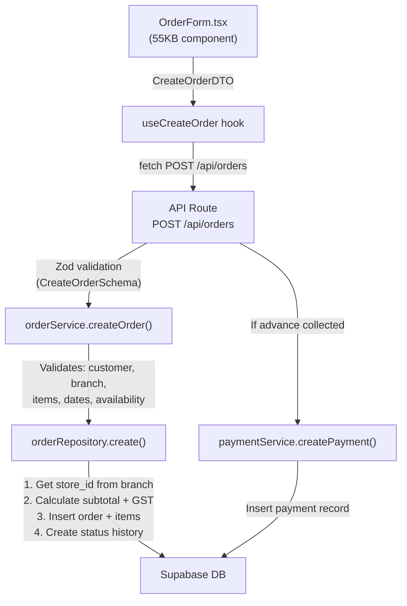
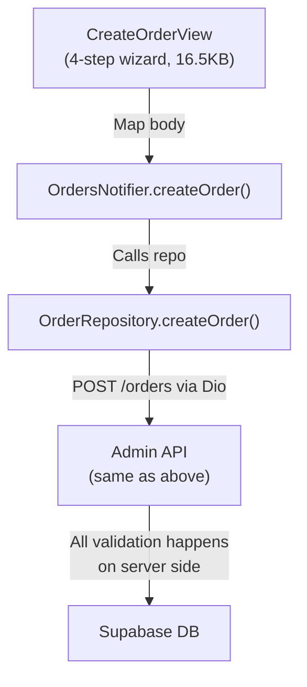
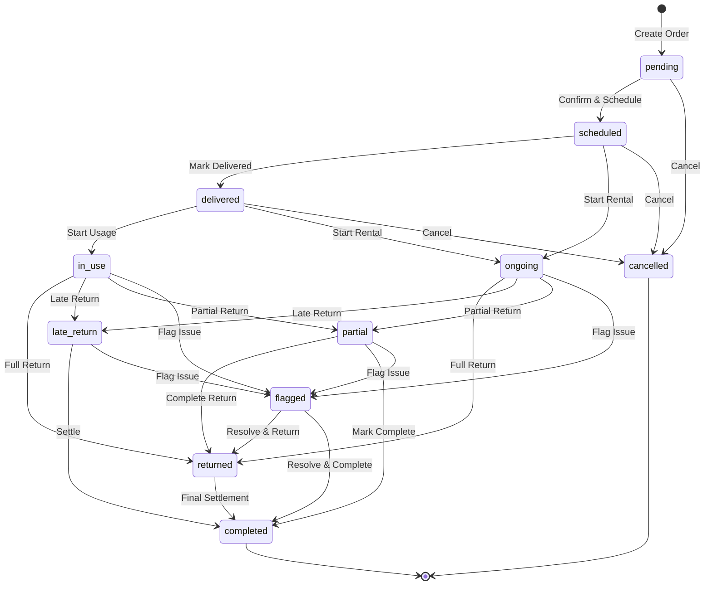

# Order Flow Deep Comparison: Admin vs Mobile

> A side-by-side analysis of how the order module works in the **Admin (Next.js)** and **Mobile (Flutter)** apps, covering architecture, data flow, business logic placement, and feature gaps.

---

## 1. Architecture Comparison

### Admin (Next.js) — 5-Layer Architecture
```
Domain → Repository → Service → Hooks → Components/Pages
```

| Layer | File | Size | Role |
|---|---|---|---|
| **Domain Types** | `domain/types/order.ts` | 6.6KB | 16 interfaces/enums, DTOs, availability types |
| **Domain Schema** | `domain/schemas/order.schema.ts` | 4.5KB | Zod validation (Create, Update, Return schemas) |
| **Repository** | `repository/orderRepository.ts` | 34.8KB | Raw Supabase CRUD + Sweep Line availability algorithm |
| **Service** | `services/orderService.ts` | 12.7KB | Business logic, validation, status transitions |
| **Hooks** | `hooks/useOrders.ts` | 9.1KB | TanStack Query hooks (7 hooks) |
| **Components** | `components/admin/Order*.tsx` | ~170KB | OrderForm, OrderDetailsView, modals, filters |
| **API Routes** | `app/api/orders/...` | ~14KB | 8 REST endpoints |
| **Total** | | **~252KB** | |

### Mobile (Flutter) — Feature-First Architecture
```
Models → Repositories → Providers → Views
```

| Layer | File | Size | Role |
|---|---|---|---|
| **Models** | `models/order.dart` | 14.9KB | Order, OrderItem, enums, relations |
| **Models** | `models/payment.dart` | 4.7KB | Payment, CreatePaymentDTO |
| **Repository** | `repositories/order_repository.dart` | 8.6KB | Dio HTTP calls to admin API |
| **Repository** | `repositories/payment_repository.dart` | 4.9KB | Payment HTTP calls |
| **Providers** | `providers/order_provider.dart` | 6.1KB | Riverpod state + pagination cache |
| **Providers** | `providers/payment_provider.dart` | 0.5KB | Payment provider (minimal) |
| **Views** | 9 view files | ~193KB | Order list, detail, create wizard, modals |
| **Total** | | **~233KB** | |

> [!IMPORTANT]
> **Key architectural difference:** Admin has business logic in its **Service layer** (validation, status transition checks, availability algorithms). Mobile has **zero business logic** — it's a pure thin client that delegates everything to the Admin API.

---

## 2. Data Flow Comparison

### Admin: Create Order Flow


### Mobile: Create Order Flow


> [!NOTE]
> The mobile app builds the order body as a raw `Map<String, dynamic>` and sends it directly. There is **no client-side Zod/schema validation** — the server does all validation.

---

## 3. Order Lifecycle — Status State Machine

Both apps share the same 12-status state machine. The transitions are enforced **only in the Admin service layer** (`orderService.ts` lines 212-225):



### Status Transition Enforcement

| Aspect | Admin | Mobile |
|---|---|---|
| **Where enforced** | `orderService.updateOrder()` — `allowedTransitions` map | Not enforced client-side |
| **Invalid transition** | Returns `INVALID_STATUS_TRANSITION` error | Relies on server-side 400 response |
| **UI protection** | Shows only valid next-status buttons | Shows only valid next-status buttons (hardcoded in `order_detail_view_new.dart`) |

---

## 4. Inventory Management — The Critical Difference

### When Stock is Deducted/Restored

| Event | What Happens | Where |
|---|---|---|
| **Order Created** | Stock NOT deducted | `orderRepository.create()` — explicit comment at line 507-509 |
| **Status → ongoing/in_use** | Stock deducted from `product_inventory` + `products` | `orderRepository.update()` lines 548-571 |
| **Status → cancelled** (from ongoing) | Stock restored | `orderRepository.update()` lines 551-552 |
| **Order Deleted** (while ongoing) | Stock restored | `orderRepository.delete()` lines 610-651 |
| **Return Processed** | Stock restored (incremental by unreturned qty) | `orderRepository.processReturn()` lines 858-888 |

### Availability Check — Sweep Line Algorithm (Admin Only)

The admin has a sophisticated **Sweep Line algorithm** for checking product availability (`orderRepository.checkAvailability()`, lines 138-260):

1. Fetches all active order items for a product
2. Applies **1-day buffer** before/after each rental for cleaning/prep
3. Creates time-sweep events (+qty at rental start, -qty at rental end)
4. Finds **peak concurrent usage** across the date range
5. Returns: `{ available, total, peakReserved, overlappingOrders }`

The mobile app calls this via `POST /orders/check-availability` — it does NOT re-implement the algorithm.

---

## 5. Payment System Comparison

### Admin Payment Flow
```
OrderForm → useCreateOrder → API POST /orders
  ↳ If advance_collected → paymentService.createPayment() (server-side, automatic)
  
OrderDetailsView → payment recording UI → API (manual payments tracked)
```

### Mobile Payment Flow
```
CreateOrderView (Step 4: Payment) → includes advance in order body
  ↳ Server handles payment record creation

OrderDetailView → PaymentRecordingModal (14.8KB) → PaymentRepository.createPayment()
  ↳ POST /payments → then GET /orders/:id → calculate new amount_paid → PATCH /orders/:id
```

> [!WARNING]
> **Mobile has a client-side payment amount calculation bug risk:** In `payment_repository.dart` (lines 32-55), after creating a payment, the mobile app:
> 1. Fetches the current order
> 2. Calculates `newAmountPaid = currentAmountPaid + signedAmount`
> 3. Patches the order with the new amount
>
> This is a **race condition** — if two people record payments simultaneously, the amount could be incorrect. The admin side handles this atomically on the server.

### Payment Types Comparison

| Payment Type | Admin | Mobile |
|---|---|---|
| Deposit | ✅ | ✅ |
| Advance | ✅ (auto-created on order creation) | ✅ (sent in order body) |
| Final | ✅ | ✅ |
| Refund | ✅ | ✅ |
| Adjustment | ✅ | ✅ |
| Cheque mode | No `cheque` in PaymentMethod enum | ✅ Has `cheque` in PaymentMode |

---

## 6. Validation Comparison

### Admin — Multi-Layer Validation

| Layer | What's Validated |
|---|---|
| **Zod Schema** | Field types, UUID formats, date formats, enum values, min items ≥ 1, date refinement (end ≥ start) |
| **Service** | customer_id required, branch_id required, items not empty, dates not empty, start < end, each item has product_id + qty ≥ 1 + price ≥ 0, **availability check per item** |
| **Repository** | DB constraints (FK, not-null) |

### Mobile — Zero Client-Side Validation

| Layer | What's Validated |
|---|---|
| **Views** | Basic form field presence (via UI disabling submit button) |
| **Repository** | Nothing — raw `Map<String, dynamic>` sent to server |
| **Server** | All validation (Zod + service layer) returns errors that mobile shows as snackbar |

---

## 7. API Endpoints — Coverage Matrix

| Endpoint | Admin Uses | Mobile Uses |
|---|---|---|
| `GET /orders` (paginated list) | ✅ useOrders hook | ✅ OrderRepository.getOrders() |
| `GET /orders/:id` (detail) | ✅ useOrder hook | ✅ OrderRepository.getOrderById() |
| `POST /orders` (create) | ✅ useCreateOrder | ✅ OrderRepository.createOrder() |
| `PATCH /orders/:id` (update) | ✅ useUpdateOrder | ✅ OrderRepository.updateOrder() |
| `DELETE /orders/:id` | ✅ useDeleteOrder | ✅ OrderRepository.deleteOrder() |
| `PATCH /orders/:id/return` | ✅ useProcessOrderReturn | ✅ OrderRepository.processReturn() |
| `PATCH /orders/:id/deposit` | ✅ useMarkDepositReturned | ✅ OrderRepository.markDepositReturned() |
| `GET /orders/:id/history` | ✅ useOrderStatusHistory | ✅ OrderRepository.getOrderHistory() |
| `POST /orders/check-availability` | ✅ (in OrderForm) | ✅ OrderRepository.checkStockAvailability() |
| `GET /orders/:id/invoice` | ✅ TallyInvoicePDF component | ❌ **NOT implemented** |
| `GET /dashboard/today-orders` | ✅ Dashboard page | ❌ Uses `/orders` with date filter |
| `GET /products/:id/orders` | ✅ Product detail page | ❌ **NOT implemented** |

---

## 8. Order Creation — Step-by-Step Comparison

### Admin: Single-Page Form (`OrderForm.tsx` — 55.8KB)

1. **Customer Selection** — Autocomplete search, inline create
2. **Product Selection** — Search products, add to cart with quantity + price
3. **Date Selection** — Start date, end date, event date, with availability calendar
4. **Real-time Availability** — Calls `/check-availability` as items/dates change
5. **Financial Summary** — Auto-calculates subtotal, GST (from settings), total
6. **Payment** — Advance amount, deposit, payment method
7. **Delivery** — Pickup/delivery, addresses
8. **Notes** — Free text
9. **Submit** — Single form submission

### Mobile: 4-Step Wizard (`create_order/` — 71.2KB total)

| Step | File | Size | Features |
|---|---|---|---|
| 1. Customer | `step_customer.dart` | 4.0KB | Customer search/select |
| 2. Products | `step_products.dart` | 17.2KB | Product search, qty, price, **availability check** |
| 3. Rental Period | `step_rental_period.dart` | 16.4KB | Start/end date pickers, event date |
| 4. Payment | `step_payment.dart` | 17.2KB | Advance, deposit, delivery method, notes |
| Wizard Shell | `create_order_view.dart` | 16.5KB | Stepper UI, validation between steps, submission |

---

## 9. Order Detail — Feature Comparison

### Admin: `OrderDetailsView.tsx` (57.4KB)

| Feature | Status |
|---|---|
| Full order info display | ✅ |
| Customer details | ✅ |
| Items with product images | ✅ |
| Status timeline/history | ✅ |
| Status transition buttons | ✅ |
| Payment recording | ✅ |
| Payment history table | ✅ |
| Return processing modal | ✅ (`OrderReturnModal.tsx` 12KB) |
| Cancel order modal | ✅ (`OrderCancelModal.tsx`) |
| Delete order modal | ✅ (`OrderDeleteModal.tsx`) |
| Deposit return button | ✅ |
| Invoice generation (PDF) | ✅ (`TallyInvoicePDF.tsx` 15.2KB) |
| Edit order link | ✅ |
| Financial breakdown | ✅ |

### Mobile: `order_detail_view_new.dart` (75.1KB)

| Feature | Status |
|---|---|
| Full order info display | ✅ |
| Customer details | ✅ |
| Items with product images | ✅ |
| Status timeline/history | ✅ |
| Status transition buttons | ✅ |
| Payment recording | ✅ (`payment_recording_modal.dart` 14.8KB) |
| Payment history list | ✅ |
| Return processing | ✅ (inline in detail view) |
| Cancel order | ✅ |
| Delete order | ✅ |
| Deposit return button | ✅ |
| Invoice generation (PDF) | ❌ **Missing** |
| Edit order | ❌ **Missing** |
| Financial breakdown | ✅ |

---

## 10. Caching & Performance

### Admin (TanStack Query)
- `staleTime: 0` for order lists (always refetch)
- `staleTime: 5min` for single orders
- `gcTime: 10min`
- `placeholderData: keepPreviousData` for pagination
- Optimistic delete (removes from cache before server confirms)

### Mobile (Custom Cache + Riverpod)
- Custom `OrdersCache` class with **1-minute TTL**
- Cache invalidated on: branch change, search change, status filter change
- `loadMore()` merges pages into single list (infinite scroll pattern)
- `ref.keepAlive()` prevents auto-disposal
- Optimistic delete (removes from state immediately)

---

## 11. Feature Gap Summary

### Features Admin Has That Mobile is Missing

| Feature | Impact | Difficulty |
|---|---|---|
| **Invoice PDF generation** | High — staff can't generate receipts on the go | Medium |
| **Edit existing order** | High — must use admin web to modify orders | Medium |
| **Order filters UI** | Medium — mobile has basic status/search, admin has date filters | Low |
| **Availability calendar view** | Low — mobile uses batch check, no per-day calendar visual | Medium |
| **Products linked to order** | Low — admin shows which orders a product appears in | Low |

### Features Mobile Has That Admin Doesn't

| Feature | Notes |
|---|---|
| **Cheque payment mode** | Mobile's `PaymentMode` enum includes `cheque`; admin's `PaymentMethod` does not |
| **Start Rental shortcut** | `OrderRepository.startRental()` — one-tap to set status to `ongoing` + set today's date |
| **Offline-friendly cache** | 1-minute TTL cache that avoids unnecessary refetches |

---

## 12. Potential Issues Found

> [!CAUTION]
> ### 1. Payment Race Condition (Mobile)
> `PaymentRepository.createPayment()` reads the order's `amount_paid`, adds the new payment amount client-side, then PATCHes the order. If two staff members record payments simultaneously, the final `amount_paid` will be wrong. **Fix:** The server should handle `amount_paid` updates atomically when creating a payment.

> [!WARNING]
> ### 2. No Client-Side Validation (Mobile)
> The mobile app sends raw maps to the server with zero validation. If the server is unreachable, users get no feedback about invalid data until the request fails. **Fix:** Add basic Dart validation before submission.

> [!NOTE]
> ### 3. Order Detail View is 75KB (Mobile)
> This is the single largest file in the entire mobile project. It handles display, status transitions, payment recording, and return processing all in one file. **Recommendation:** Split into smaller widgets.

> [!NOTE]
> ### 4. Pricing Model: Flat vs Per-Day
> The admin's `orderRepository.create()` has an explicit comment: *"flat rent price × quantity (no per-day multiplication)"*. The field is named `price_per_day` but it's actually used as a **flat rental price**. The mobile form's labels should reflect this.
