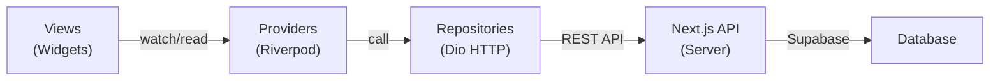
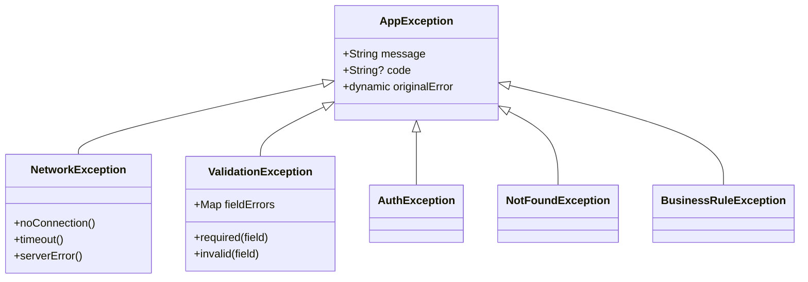
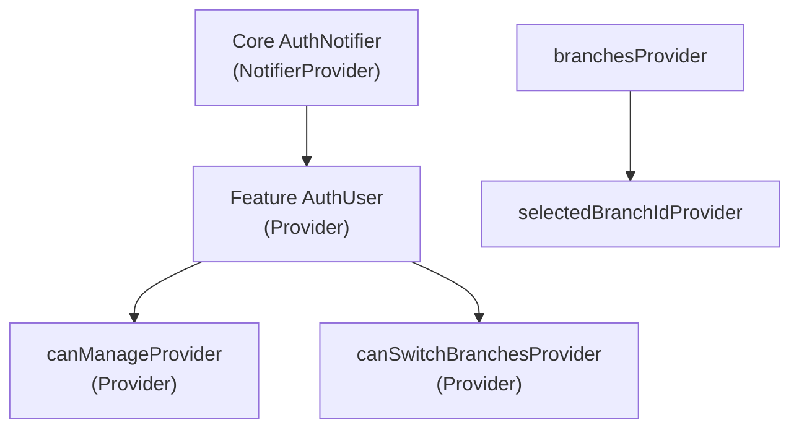

# Paris Bridals Mobile — Comprehensive Project Analysis

> **Location:** `apps/mobile/` within the Paris Bridals monorepo  
> **Framework:** Flutter (Dart SDK `^3.11.4`)  
> **Role:** Mobile admin dashboard — a **thin client** that talks exclusively to the Next.js Admin API

---

## 1. What This App Is

The mobile app is a **companion admin dashboard** for the Paris Bridals jewellery rental business. It mirrors the web admin portal (`apps/admin/`) and lets store managers, admins, and staff manage products, categories, orders, customers, and branches **from their phone**.

> [!IMPORTANT]
> The mobile app **never** talks to Supabase directly. All data flows through the centralized Next.js API at `https://admin.parisbridals.com/api`. This means all business logic, validation, and RBAC enforcement lives on the server.

---

## 2. Technology Stack

| Technology | Version | Purpose |
|---|---|---|
| **Flutter** | SDK `^3.11.4` | UI framework |
| **Riverpod** | `flutter_riverpod ^3.3.1` + `riverpod_annotation ^4.0.2` | State management |
| **Dio** | `^5.9.2` | HTTP client for REST API calls |
| **flutter_secure_storage** | `^10.0.0` | Securely store auth tokens |
| **flutter_dotenv** | `^6.0.1` | Load `.env` file for API base URL |
| **cached_network_image** | `^3.4.1` | Efficient image caching |
| **shimmer** | `^3.0.0` | Skeleton loading effects |
| **image_picker** | `^1.1.2` | Camera & gallery image selection |
| **flutter_svg** | `^2.2.4` | SVG logo rendering |
| **intl** | `^0.20.2` | Date/number formatting |
| **equatable** | `^2.0.8` | Value equality for models |
| **url_launcher** | `^6.3.1` | Launch external URLs |
| **mobile_scanner** | `^7.2.0` | Barcode scanning |

### Dev Dependencies
| Package | Purpose |
|---|---|
| `build_runner ^2.14.0` | Code generation runner |
| `riverpod_generator ^4.0.3` | Auto-generate Riverpod providers |
| `flutter_lints ^6.0.0` | Lint rules |

---

## 3. Architecture — Feature-First with Clean Layers

The app follows a **feature-first architecture** where every feature module is self-contained with its own models, repositories, providers, and views.

### Data Flow Pattern



### Layer Responsibilities

| Layer | Responsibility | Rule |
|---|---|---|
| **Models** | Data classes with `fromJson`/`toJson` | Pure data, no side effects |
| **Repositories** | HTTP calls via Dio to Next.js API | No UI logic, no state management |
| **Providers** | Riverpod state management | Calls repositories, exposes state to views |
| **Views** | UI widgets and screens | Consumes providers, never calls Dio directly |

> [!WARNING]
> Providers must **never** call Dio directly — always go through a repository.

---

## 4. Directory Structure

```
lib/
├── main.dart                          # App entry point (ProviderScope + MaterialApp)
├── core/                              # Shared infrastructure
│   ├── api_client.dart                # Singleton Dio client (4.7KB)
│   ├── auth_service.dart              # Auth login/logout/token management (4.6KB)
│   ├── constants.dart                 # AppColors palette (1.2KB)
│   ├── enums.dart                     # PaymentMethod, PaymentKind enums (2.9KB)
│   ├── main_layout.dart               # Main Scaffold + Drawer + BottomNav (17KB)
│   ├── responsive.dart                # Responsive scaling utility (2.7KB)
│   ├── theme.dart                     # AppTheme (Material 3 light theme) (2.2KB)
│   ├── upload_repository.dart         # Shared file upload to R2 (1.7KB)
│   └── providers/
│       └── auth_provider.dart         # Core AuthNotifier + AuthState (2.4KB)
├── exceptions/
│   └── app_exceptions.dart            # Custom exception hierarchy (3.3KB)
├── features/
│   ├── auth/                          # Authentication
│   ├── dashboard/                     # Home dashboard
│   ├── products/                      # Product CRUD
│   ├── categories/                    # Category CRUD
│   ├── orders/                        # Order management (largest module)
│   ├── customers/                     # Customer CRUD
│   ├── branches/                      # Branch management
│   └── calendar/                      # Calendar/rental scheduling
└── utils/
    └── currency_formatter.dart        # ₹ currency formatting
```

---

## 5. Core Layer — Deep Dive

### 5.1 API Client ([api_client.dart](file:///c:/Personal%20Projects/parisbridals/apps/mobile/lib/core/api_client.dart))

- **Singleton** `ApiClient` with lazy-initialized Dio instance
- Base URL loaded from `.env` (`API_BASE_URL=https://admin.parisbridals.com/api`)
- **Interceptors:**
  - `onRequest`: Injects Bearer token from `FlutterSecureStorage` (cached after first read)
  - `onError`: On 401 → attempts **automatic token refresh** via `/auth/refresh`, then retries the original request. If refresh fails → clears all auth data (forces re-login)
- **Timeouts:** 15s connect, 15s receive
- Exports: `apiClient` (Dio instance) + `apiClientInstance` (for preload/clear)

### 5.2 Auth Service ([auth_service.dart](file:///c:/Personal%20Projects/parisbridals/apps/mobile/lib/core/auth_service.dart))

- `AuthUser` model: `id`, `email`, `role`, `storeId`, `branchId`, `staffId`, `accessToken`, `refreshToken`
- **Login flow:** `POST /auth/login` → stores tokens + user JSON in secure storage → preloads token into ApiClient cache
- **Logout:** Clears all secure storage keys + cached token
- **getCurrentUser:** First tries `GET /auth/me`, falls back to locally stored user JSON on failure

### 5.3 Theme ([theme.dart](file:///c:/Personal%20Projects/parisbridals/apps/mobile/lib/core/theme.dart))

Premium 4-color palette:

| Color | Hex | Usage |
|---|---|---|
| **Charcoal** | `#434343` | Primary — AppBar, buttons, text |
| **Off-White** | `#F8F8F8` | Scaffold background |
| **Almond** | `#FAEBCD` | Surface — cards, inputs, search bars |
| **Golden** | `#F7C873` | Accent — prices, FABs, active nav |

- Material 3 enabled
- `scrolledUnderElevation: 0` (AppBar doesn't change color on scroll)
- Input decoration: filled with Almond, rounded 12px corners

### 5.4 Responsive System ([responsive.dart](file:///c:/Personal%20Projects/parisbridals/apps/mobile/lib/core/responsive.dart))

Base design: **375 × 812** (iPhone X). All sizes are scaled proportionally.

| Method | Purpose | Formula |
|---|---|---|
| `Responsive.w(n)` | Horizontal sizes | `n × (screenWidth / 375)` |
| `Responsive.h(n)` | Vertical sizes | `n × (screenHeight / 812)` |
| `Responsive.sp(n)` | Font sizes | `n × scaleWidth.clamp(0.8, 1.4)` |
| `Responsive.icon(n)` | Icon sizes | Same as `sp()` |
| `Responsive.r(n)` | Border radii | Same as `w()` |
| `Responsive.all(n)` | Uniform padding | Uses `w()` for all sides |
| `Responsive.symmetric(h, v)` | Symmetric padding | `w(h)` horizontal, `h(v)` vertical |
| `Responsive.only(...)` | Custom padding | Per-side scaling |

> [!NOTE]
> Safe defaults (375×812, scale=1.0) are provided so the app doesn't crash with `LateInitializationError` if `init()` isn't called before widget tree builds.

### 5.5 Constants ([constants.dart](file:///c:/Personal%20Projects/parisbridals/apps/mobile/lib/core/constants.dart))

`AppColors` class with:
- **Primary palette:** `primary`, `accent`, `surface`, `background`
- **Status colors:** `danger`, `success`, `warning`, `info`
- **Order status colors:** `scheduled`, `ongoing`, `completed`, `cancelled`, `lateReturn`, `partial`

### 5.6 Enums ([enums.dart](file:///c:/Personal%20Projects/parisbridals/apps/mobile/lib/core/enums.dart))

- `PaymentMethod`: cash, upi, card, bankTransfer, cheque, other (with `displayName`, `fromString()`, `toApiString()`)
- `PaymentKind`: deposit, advance, final_, refund, adjustment

### 5.7 Exception System ([app_exceptions.dart](file:///c:/Personal%20Projects/parisbridals/apps/mobile/lib/exceptions/app_exceptions.dart))



### 5.8 Main Layout ([main_layout.dart](file:///c:/Personal%20Projects/parisbridals/apps/mobile/lib/core/main_layout.dart))

The central scaffold that wraps all main screens. **17KB** — the largest core file.

**Components:**
1. **AppBar** — Shows Paris Bridals logo + title on Home, section titles on other tabs. Includes:
   - **Branch Switcher** (PopupMenuButton) — only visible for admin users (`canSwitchBranches`)
   - Notification icon
2. **Drawer** — User profile header (name, email, role badge) + logout button
3. **BottomNavigationBar** — 4 tabs: Home, Orders, Calendar, Products
   - Golden accent for selected tab
   - Charcoal background

**Bottom Nav Tabs:**

| Index | Tab | View |
|---|---|---|
| 0 | Home | `DashboardView` |
| 1 | Orders | `OrdersView` |
| 2 | Calendar | `CalendarView` |
| 3 | Products | `ProductsView` |

---

## 6. Feature Modules — Deep Dive

### 6.1 Auth Module (`features/auth/`)

```
auth/
├── data/           # (exists but empty/minimal)
├── domain/         # (exists but empty/minimal)
├── providers/
│   └── auth_provider.dart     # AuthUser model + role-based providers
└── views/
    ├── login_view.dart        # Login screen (10.9KB)
    └── splash_view.dart       # Splash/auto-login screen (5.0KB)
```

**Key Components:**
- `AuthUser` (feature-level): Maps core auth data → UI-friendly model with `canManage`, `isAdmin`, `canSwitchBranches`, `roleLabel`
- `UserRole` enum: `superAdmin`, `admin`, `manager`, `staff`
- `authUserProvider`: Watches core auth state, transforms to feature `AuthUser`
- `canManageProvider`: Boolean — can create/edit/delete?
- **Login View:** Premium UI with Paris Bridals branding, email/password form
- **Splash View:** Checks auth status → routes to `MainLayout` or `LoginView`

**RBAC Matrix:**

| Role | View | Create/Edit/Delete | Settings | Switch Branches |
|---|---|---|---|---|
| Super Admin | ✅ | ✅ | ✅ | ✅ |
| Admin | ✅ | ✅ | ✅ | ✅ |
| Manager | ✅ | ✅ | ❌ | ❌ |
| Staff | ✅ | ❌ | ❌ | ❌ |

---

### 6.2 Dashboard Module (`features/dashboard/`)

```
dashboard/
├── providers/
│   └── dashboard_provider.dart     # Summary stats provider (1.7KB)
├── repositories/
│   └── dashboard_repository.dart   # API calls for stats (2.9KB)
└── views/
    └── dashboard_view.dart         # Home screen UI (12.1KB)
```

**Features:**
- Dynamic greeting banner
- Quick action buttons (New Order, Add Product, etc.)
- Summary stats cards (Total Sales, Pending Orders, Customers)
- Recent orders list

---

### 6.3 Products Module (`features/products/`) — Most Complex CRUD

```
products/
├── models/
│   └── product.dart               # Product + BranchInventory + ProductImage + ProductVariant (10.1KB)
├── providers/
│   └── product_provider.dart      # Full product state management (8.8KB)
├── repositories/
│   └── product_repository.dart    # CRUD + pagination API calls (6.6KB)
└── views/
    ├── products_view.dart         # Product list with infinite scroll (26.5KB)
    ├── product_detail_view.dart   # Product detail screen (25.7KB)
    └── product_form_view.dart     # Create/Edit product form (35.8KB)
```

**Product Model Highlights (Jewellery Rental):**
- `pricePerDay` (NOT purchase price)
- `securityDeposit`
- `minRentalDays`, `maxRentalDays`
- Jewellery fields: `material`, `metalPurity`, `metalColor`, `weightGrams`
- Inventory: `totalQuantity`, `availableQuantity`, `reservedQuantity`, `maintenanceQuantity`
- `condition`, `sanitizationStatus`
- `List<ProductImage>` with `isPrimary` support
- `List<ProductVariant>` for sizes & colors
- `List<BranchInventory>` for multi-branch stock tracking

**Key Features:**
- Infinite scroll with pagination (`page` + `limit` params)
- "Fire-and-forget" saving — UI pops instantly, background API submission
- Barcode auto-generation (8-digit numeric)
- Camera & gallery integration for images
- Cascading category selection (Main → Sub → Variant)

---

### 6.4 Categories Module (`features/categories/`)

```
categories/
├── models/
│   └── category.dart              # 3-level hierarchy model (3.0KB)
├── providers/
│   └── category_provider.dart     # Category state (1.9KB)
├── repositories/
│   └── category_repository.dart   # CRUD + children fetching (3.7KB)
└── views/
    ├── categories_view.dart       # Category tree list (15.1KB)
    ├── category_detail_view.dart  # Detail with children (18.5KB)
    └── category_form_view.dart    # Create/Edit form (21.0KB)
```

**3-Level Hierarchy:**
```
Main Category (parent_id = null)
├── Sub Category (parent_id = main.id)
│   └── Variant (parent_id = sub.id) ← LEAF NODE
```

---

### 6.5 Orders Module (`features/orders/`) — Largest Module (~170KB)

```
orders/
├── models/
│   ├── order.dart                 # Order + OrderItem + enums (14.9KB)
│   └── payment.dart               # Payment model (4.7KB)
├── providers/
│   ├── order_provider.dart        # Order state management (6.1KB)
│   └── payment_provider.dart      # Payment state (0.5KB)
├── repositories/
│   ├── order_repository.dart      # Order API calls (8.6KB)
│   └── payment_repository.dart    # Payment API calls (4.9KB)
└── views/
    ├── orders_view.dart           # Order list with filters (23.4KB)
    ├── order_detail_view_new.dart  # Full order detail (75.1KB!) ⭐ Largest file
    ├── customer_search_field.dart  # Customer autocomplete (15.7KB)
    ├── product_search_field.dart   # Product autocomplete (9.3KB)
    ├── payment_recording_modal.dart # Record payments modal (14.8KB)
    └── create_order/
        ├── create_order_view.dart  # Multi-step order wizard (16.5KB)
        ├── step_customer.dart      # Step 1: Select customer (4.0KB)
        ├── step_products.dart      # Step 2: Select products (17.2KB)
        ├── step_rental_period.dart  # Step 3: Set dates (16.4KB)
        └── step_payment.dart       # Step 4: Payment details (17.2KB)
```

**Order Model:**
- Full lifecycle statuses: pending → confirmed → scheduled → delivered → inUse → ongoing → partial → returned → completed → cancelled → flagged → lateReturn
- Payment tracking: `amountPaid`, `paymentStatus`, `depositCollected`, `advanceAmount`
- Delivery: pickup or delivery with addresses
- Financial: `subtotal`, `gstAmount`, `securityDeposit`, `lateFee`, `discount`, `damageChargesTotal`
- Relations: `CustomerInfo`, `List<OrderItem>`, `BranchInfo`, `StoreInfo`

**Create Order Flow (Multi-step Wizard):**
1. **Select Customer** — search/autocomplete
2. **Select Products** — search, add quantities
3. **Set Rental Period** — start/end dates, event date
4. **Payment Details** — advance, deposit, payment method

---

### 6.6 Customers Module (`features/customers/`)

```
customers/
├── models/
│   └── customer.dart              # Customer model (3.9KB)
├── providers/
│   └── customer_provider.dart     # Customer state (1.7KB)
├── repositories/
│   └── customer_repository.dart   # CRUD API calls (3.7KB)
└── views/
    ├── customers_view.dart        # Customer list (6.8KB)
    ├── customer_detail_view.dart   # Customer detail (6.0KB)
    └── customer_form_view.dart    # Create/Edit form (6.9KB)
```

---

### 6.7 Branches Module (`features/branches/`)

```
branches/
├── models/
│   └── branch.dart                # Branch model (2.0KB)
├── providers/
│   └── branch_provider.dart       # Branch state + selector (4.0KB)
├── repositories/
│   └── branch_repository.dart     # Branch API calls (2.3KB)
└── views/
    ├── branches_view.dart         # Branch list (3.5KB)
    ├── branch_detail_view.dart    # Branch detail (5.2KB)
    └── branch_form_view.dart      # Create/Edit form (4.8KB)
```

Key feature: **Branch Switching** — admins can switch between branches via the AppBar dropdown, which filters data across all other modules.

---

### 6.8 Calendar Module (`features/calendar/`)

```
calendar/
├── providers/
│   └── calendar_provider.dart     # Calendar state (4.1KB)
├── repositories/
│   └── calendar_repository.dart   # Calendar API calls (5.0KB)
└── views/
    └── calendar_view.dart         # Calendar UI (22.1KB)
```

Rental scheduling calendar showing booked dates, upcoming returns, and availability.

---

## 7. State Management — Riverpod

The app uses **Riverpod 3.x** with the Notifier pattern:



**Pattern:**
1. `NotifierProvider` for complex state (auth, products, orders)
2. `Provider` for derived/computed values (`canManage`, `authUser`)
3. `StateProvider` for simple values (`selectedBranchId`)

---

## 8. File Size Distribution (By Module)

| Module | Total Size | Files | Notes |
|---|---|---|---|
| **Orders** | ~170.2 KB | 11 files | Largest — `order_detail_view_new.dart` alone is 75KB |
| **Products** | ~98.9 KB | 6 files | Second largest |
| **Categories** | ~57.7 KB | 6 files | |
| **Core** | ~36.0 KB | 9 files | Infrastructure |
| **Calendar** | ~31.2 KB | 3 files | |
| **Customers** | ~23.1 KB | 6 files | |
| **Auth** | ~18.5 KB | 4 files (feature level) | |
| **Branches** | ~18.1 KB | 6 files | |
| **Dashboard** | ~16.7 KB | 3 files | |
| **Total** | **~478 KB** | **61 files** | Across entire `lib/` |

---

## 9. API Endpoints Used

All requests go to `https://admin.parisbridals.com/api`:

| Module | Endpoints |
|---|---|
| **Auth** | `POST /auth/login`, `POST /auth/refresh`, `GET /auth/me` |
| **Products** | `GET /products`, `GET /products/:id`, `POST /products`, `PATCH /products/:id`, `DELETE /products/:id` |
| **Categories** | `GET /categories`, `GET /categories/:id`, `GET /categories/:id/children`, `POST /categories`, `PATCH /categories/:id`, `DELETE /categories/:id` |
| **Orders** | `GET /orders`, `GET /orders/:id`, `POST /orders`, `PATCH /orders/:id`, `PATCH /orders/:id/status` |
| **Customers** | `GET /customers`, `GET /customers/:id`, `POST /customers`, `PATCH /customers/:id` |
| **Branches** | `GET /branches`, `GET /branches/:id`, `POST /branches`, `PATCH /branches/:id` |
| **Dashboard** | `GET /dashboard/stats` |
| **Upload** | `POST /upload` (multipart form data → Cloudflare R2) |

---

## 10. Security

1. **Token Storage:** `FlutterSecureStorage` (encrypted on-device storage)
2. **Auto Token Refresh:** Interceptor catches 401 → tries `/auth/refresh` → retries request
3. **No Hardcoded Secrets:** API URL and R2 config loaded from `.env`
4. **Thin Client:** No direct database access — all validation happens server-side
5. **RBAC:** UI elements conditionally shown based on `canManage`/`isAdmin` flags

---

## 11. Current Roadmap / TODOs

Based on the README and codebase analysis:

| Item | Status |
|---|---|
| Authentication (Login/Splash/Tokens) | ✅ Done |
| Dashboard with stats | ✅ Done |
| Product CRUD + pagination | ✅ Done |
| Category 3-level CRUD | ✅ Done |
| Order listing + detail view | ✅ Done |
| Order creation wizard (4 steps) | ✅ Done |
| Payment recording modal | ✅ Done |
| Customer CRUD | ✅ Done |
| Branch management + switching | ✅ Done |
| Calendar/rental scheduling | ✅ Done |
| Barcode scanning | ✅ Package added |
| Drawer menu items | ⚠️ Stubbed (only logout) |
| Push notifications | ❌ Not started |
| Offline mode | ❌ Not started |
| Settings screen | ❌ Not started |
| iOS build setup | ❌ Not verified |

> [!TIP]
> The drawer menu items (lines 180-186 in `main_layout.dart`) are currently empty stubs — they just show the logout button regardless of role. This is a quick win to implement proper navigation to Categories, Customers, Branches, etc.
